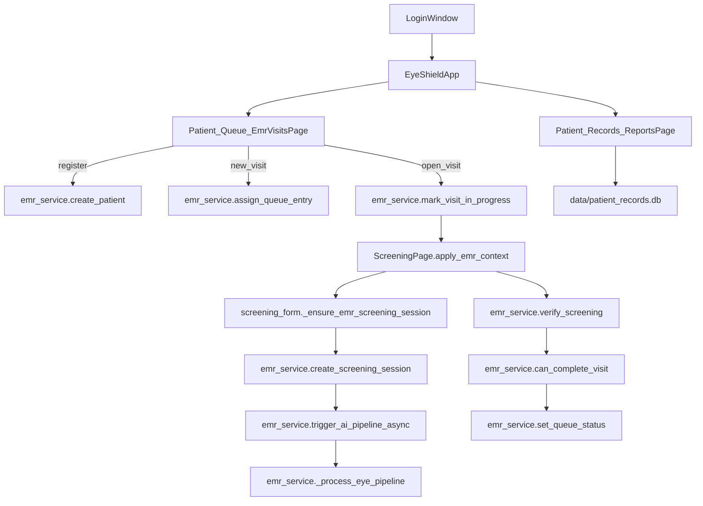
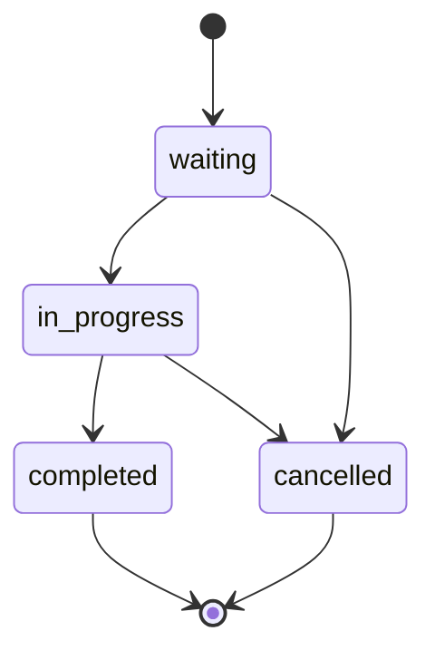
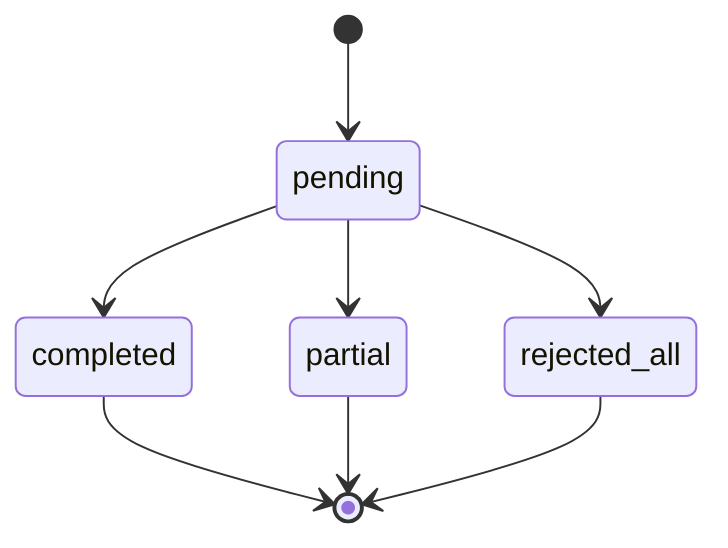

# EyeShield — System flow & state logic

This document maps the current workflow and highlights key state machines used by the app.

## Entities (conceptual)

- **User**: `users` table in `data/users.db` (auth + roles + profiles)
- **Visit / Queue entry**: `emr_queue_entries` in `data/users.db`
- **Screening session**: `emr_screenings` (+ per-eye rows `emr_screening_eyes`) in `data/users.db`
- **Legacy record rows**: `patient_records` table in `data/patient_records.db` (Dashboard / Patient Records UI)

## High-level flow

## State machine: Visit / Queue entry

Stored in `emr_queue_entries.status` (see `app/emr_service.py`).

Key guard helpers:

- `emr_service.can_create_visit_for_patient(patient_id)`
- `emr_service.mark_visit_in_progress(queue_id, user_id)`
- `emr_service.can_cancel_visit(queue_id)`
- `emr_service.can_complete_visit(queue_id)`

## State machine: Screening session

Stored in `emr_screenings.session_status` and per-eye `emr_screening_eyes.image_quality_status` / `uncertainty_status`.

How it transitions today:

- Session created by `emr_service.create_screening_session(...)` (initially `pending`)
- AI pipeline updates per-eye rows in `emr_service._process_eye_pipeline(...)`
- Session can be finalized by clinician verification in `emr_service.verify_screening(...)`

## UI “navigation lock” (anti-dead-state)

The Screening UI blocks navigation while inference is running using:

- `ScreeningPage._set_navigation_locked(True/False)` in `app/screening_form.py`
- `_InferenceWorker.isRunning()` from `app/screening_worker.py`

If inference completes or errors, the handlers unlock navigation:

- `_on_inference_done(...)` / `_on_inference_error(...)` / `_on_image_ungradable(...)`

## Legacy records (`patient_records.db`) and grouping

The **Dashboard** and **Patient Records** list are built from `data/patient_records.db` (not from EMR tables).

- Dashboard query: `app/dashboard.py` `refresh_dashboard()` reads `patient_records` and calculates KPIs.
- Patient Records list: `app/reports.py` `refresh_report()` reads many columns, then `group_patient_record_rows(...)` groups per-eye rows into a visit group (`screening_group_id`).

If this DB is missing columns or the app reads/writes a different DB file, the UI can appear empty or inconsistent.

